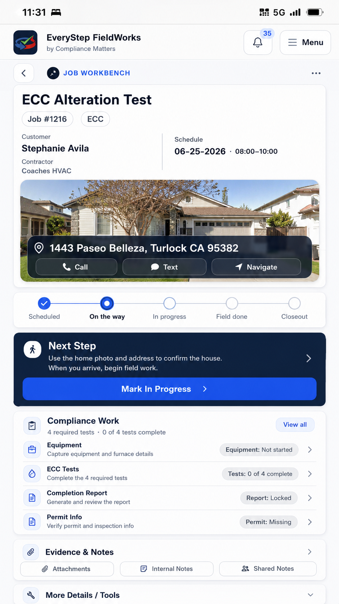

# EveryStep FieldWorks — Mobile Job Page V2 Blueprint

**Status:** ACTIVE DESIGN BLUEPRINT — NOT IMPLEMENTED  
**Date:** 2026-06-25  
**Scope:** Internal mobile `/jobs/[id]` only  
**Authority:** Subordinate to `Active Spine V4.0 Current.md`, the current workflow-modernization documents, and existing job-detail source-of-truth, role, billing, ECC, service-case, and mobile action contracts.

---

## 1. Executive summary

The mobile job page should mature from a complete vertical record into a **readable, state-led job command surface**.

The objective is not to minimize scrolling at all costs, compress the interface into a dense dashboard, or hide routine work behind layers. The objective is to remove repetition, clarify hierarchy, and make the next responsibility obvious while preserving all current workflow logic and source-of-truth boundaries.

The V2 thesis is:

> **Show the job clearly, lead with one dominant next responsibility, present the correct job-type work lane, and keep supporting context and advanced tools available without giving everything equal visual weight.**

The current visual language is good and should remain recognizable. V2 is primarily an information-architecture, hierarchy, and state-awareness redesign.

---

## 1.1 Approved ECC visual anchor

**Visual status:** APPROVED CONCEPTUAL ANCHOR — ECC MOBILE JOB PAGE V2, ANCHOR A  
**Anchor asset:** `assets/Mobile_Job_Page_V2_ECC_Anchor_A.png`

This image is the approved visual anchor for the first ECC mobile V2 composition. It is not a pixel-perfect production specification, and its sample labels, counts, statuses, and actions are not authoritative. Existing application logic, gates, source-of-truth rules, and current action contracts remain authoritative.

The anchor confirms the following structural direction:

- A **photo-led job hero** is retained because the home image is operationally important for technicians and raters locating the correct property while traveling to the appointment.
- The address appears once, associated with the property image, with clear Call, Text, and Navigate access.
- Job identity, customer, contractor, and schedule remain readable without turning the header into a dense dashboard.
- A simple lifecycle rail provides orientation: scheduled, on the way, in progress, field done, and closeout. It is an orientation aid, not a replacement lifecycle model.
- One state-derived **Next Step** remains visually dominant.
- ECC work is presented as a purposeful **Compliance Work** lane rather than being led by generic billing or a universal action grid.
- Compliance launchers and read-only status indicators are visually distinct.
- Evidence and notes remain easy to reach, while advanced tools stay lower in the hierarchy.
- The layout favors readable type, generous tap targets, and field usability over maximum information density.

### 1.1.1 Photo hero contract

The property image is not decorative. It is a field-orientation aid.

The V2 implementation must:

- preserve a prominent house/street image when a usable preview is available;
- keep the service address and Navigate action available with the image;
- avoid repeating the service address in the collapsed Job Context section;
- provide a clear address-first fallback if the preview is unavailable, delayed, or unsupported;
- preserve current location truth and map/navigation behavior;
- avoid implying that the image itself is authoritative for access, ownership, or current site conditions.

Exact crop, overlay opacity, image height, provider treatment, and loading/fallback presentation remain prototype decisions.

### 1.1.2 Action and status interpretation

The anchor uses sample actions and labels to communicate hierarchy only.

Before implementation, every visible action and status must be derived from current code and verified against the actual ECC state contract. In particular:

- the primary action must come from existing lifecycle, ECC, permit, retest, correction, cert, and closeout gates;
- test counts must come from existing ECC truth;
- permit wording must reflect current permit requirements and availability rules;
- completion-report availability must follow current gating;
- action launchers must use clear tap affordances;
- read-only statuses must remain flat, labeled, and non-interactive unless the row is intentionally designed as a launcher.

The mock-up must never be used as authority to invent a new action, status, test requirement, or closeout rule.

### 1.1.3 What the anchor locks

The anchor locks:

- the photo-led hero as an important ECC field-orientation surface;
- the overall hierarchy and section order;
- the lifecycle-orientation rail concept;
- one dominant next-responsibility card;
- ECC-first Compliance Work framing;
- explicit separation between launchers and statuses;
- readable, non-compressed mobile sizing;
- demotion of generic context, billing, history, and advanced tools until relevant.

### 1.1.4 What the anchor does not lock

The anchor does not lock:

- exact production labels or helper copy;
- exact button availability;
- exact test counts or status values;
- exact colors, icons, shadows, spacing, or typography values;
- exact sticky behavior;
- exact provider/fallback behavior for the property image;
- exact lifecycle-rail interaction behavior;
- the Service-family work-lane content or ordering beyond the shared shell concept.

### 1.1.5 Service-family derivative

Service jobs should derive from the same shell rather than become a separate design system:

- photo-led command hero;
- lifecycle orientation;
- one dominant next responsibility;
- Service-specific Work Performed lane;
- state-relevant billing/closeout promotion;
- Evidence/Notes, compact Job Context, and advanced tools.

The Service configuration requires its own explicit visual/state pass after the ECC anchor is proven. It must not be inferred by replacing ECC labels inside the approved image.

---

## 2. Scope lock

### In scope

- Internal mobile `/jobs/[id]` page layout and hierarchy.
- State-aware section ordering.
- ECC-specific and Service-specific mobile work lanes.
- Clear separation of actions, status indicators, alerts, summaries, and launchers.
- Compression of repeated or low-frequency context.
- Accessibility/readability design rules.
- Preservation matrix for current actions, gates, anchors, and source-of-truth behavior.
- Implementation sequencing and acceptance criteria.

### Out of scope

- Desktop job-detail redesign.
- Contractor portal job-detail redesign.
- Internal `/jobs/new` redesign.
- Contractor intake redesign.
- Invoice workspace redesign beyond its placement/entry relationship to the job page.
- New statuses, schema, migrations, server actions, helpers, truth models, permissions, billing rules, ECC rules, or workflow semantics.
- Removing existing capabilities merely because they are no longer first-class on the main scroll.

---

## 3. Design principles

### 3.1 Readability before density

Do not reduce scroll by shrinking text, controls, or spacing below comfortable field-use levels.

Reduce scroll by:

- removing repeated facts,
- collapsing completed or low-frequency detail,
- showing state-relevant content first,
- moving advanced forms behind focused launchers,
- suppressing irrelevant sections until they become meaningful.

### 3.2 One dominant next responsibility

At any job state, one action or responsibility should visually lead.

Examples:

- Mark On the Way
- Mark In Progress
- Open Tests
- Finish Visit
- Add Permit
- Confirm Retest Ready
- Build Invoice
- Mark External Billing Complete
- Mark Ready to Continue

The page may show supporting actions, but they must not compete equally with the current primary responsibility.

### 3.3 Job-type-aware, not one universal stack

ECC and Service remain the two top-level workflow families.

- ECC jobs should be led by compliance work: equipment, tests, completion/reporting, permits, certs, correction, and retest.
- Service jobs should be led by visit reason, Work Items, field finish, waiting/follow-up, and billing/closeout.
- An ECC visit may show companion service work, but companion work must not visually replace the ECC work lane.

### 3.4 Actions and status are visually different

Users must immediately understand whether an element can be tapped.

- **Primary action:** large filled button or dominant action card.
- **Secondary action:** outlined button or explicit launcher row.
- **Status indicator:** read-only label/value, no button border, no press affordance.
- **Attention indicator:** warning/exception summary with a related action nearby.
- **Launcher:** row or card that clearly opens a focused tool or workspace.

Example:

- `Equipment` = action launcher.
- `Equipment: Not started` = read-only status.
- `Permit: Missing` = read-only attention status.
- `Add Permit` = action.

### 3.5 Do not repeat job identity

The command header owns:

- job title,
- job reference,
- job type,
- customer/account,
- service address,
- schedule,
- high-frequency contact/navigation actions.

Lower cards must not repeat the address or other header facts unless the user opens a detailed location workspace.

### 3.6 Routine work stays visible

Progressive disclosure is for low-frequency, advanced, historical, destructive, or administrative work.

Do not bury:

- the current lifecycle action,
- current ECC work,
- Service Work Items,
- the field finish flow,
- active blockers,
- current billing/closeout responsibility,
- evidence/notes entry points needed during the visit.

### 3.7 Preserve capability, not full-size placement

A capability may move from a full card to a compact summary or launcher without being lost.

“Do not lose” means preserve:

- action availability,
- role gate,
- job-state gate,
- source-of-truth behavior,
- redirects and return anchors,
- records and history.

It does not mean every current section must remain fully expanded on the main scroll.

---

## 4. Accessibility and readability contract

These are V2 design targets, not implementation of a new accessibility subsystem.

### Typography

- Primary job title: approximately 28–32 px equivalent.
- Section title: approximately 21–24 px.
- Primary action label: approximately 18–20 px.
- Body text: approximately 17–18 px.
- Secondary/helper text: approximately 15–16 px.
- Small labels/status captions: approximately 13–14 px only when paired with a larger readable value.
- Avoid long all-caps phrases; reserve uppercase for short labels.

### Controls

- Standard tap target height: approximately 52–56 px.
- Primary actions may be 56–64 px high.
- Do not create narrow icon-only actions for essential work.
- Destructive actions require clear text labels, not color alone.

### Contrast and meaning

- Never rely on color alone to convey status.
- Pair color with a label such as `Missing`, `Ready`, `Waiting`, `Failed`, or `Complete`.
- Keep helper copy short enough to scan without becoming tiny.

### Field conditions

The design must remain usable:

- outdoors and in glare,
- one-handed,
- with imperfect eyesight,
- with interrupted attention,
- while moving between truck, site, and office contexts.

---

## 5. Mobile V2 page zones

## 5.1 Global feedback strip

### Purpose

Show action results, save confirmations, errors, and state-transition feedback without disrupting the page hierarchy.

### Contains

- Current route-level flash banners.
- Save/transition outcomes.
- Note/mention feedback.
- Invoice/closeout action feedback.
- On-the-way undo outcomes.

### Rules

- Render above the command surface.
- Avoid large permanent success cards after the result has been acknowledged.
- Preserve current query-param/banner handling.

---

## 5.2 Job Command Header

### Purpose

Answer immediately:

- What job is this?
- Who is it for?
- Where is it?
- When is it?
- What state is it in?

### Contains

- Job title.
- Job reference.
- Job type.
- Customer/account link.
- Service address link.
- Schedule date/window or unscheduled state.
- Current lifecycle/status label.
- Call, Text, Navigate actions where available.

### Rules

- Keep current job identity quality.
- Tighten internal spacing only if readability remains strong.
- Address appears here once; do not repeat it in Job Context.
- Schedule may remain a compact inner block or become a readable row; exact treatment remains a prototype decision.
- Low-frequency edit controls may use an overflow or explicit `Edit schedule` action.

---

## 5.3 Current Responsibility / Next Step

### Purpose

Provide one dominant action and a plain-language explanation of why it is next.

### Structure

- Short state label.
- Plain-language instruction.
- One primary action.
- Zero to two closely related secondary actions.

### Examples

#### Scheduled/Open

- Instruction: `Head to the job when ready.`
- Primary: `Mark On the Way`
- Secondary: `Edit schedule`

#### On the Way

- Instruction: `Start the visit when you arrive.`
- Primary: `Mark In Progress`
- Secondary: `Undo On the Way`

#### In Progress — ECC

- Instruction: `Capture equipment and complete required tests.`
- Primary: `Open Tests` or `Add / View Equipment`, based on readiness.
- Secondary: the other ECC work action.

#### In Progress — Service

- Instruction: `Complete the work, update Work Items, then finish the visit.`
- Primary: `Finish Visit` when the current gate allows it.
- Secondary: `Adjust Work`

#### Field Complete — ECC permit missing

- Instruction: `Add the permit to continue cert closeout.`
- Primary: `Add Permit`
- Secondary: `Open Tests` / `Completion Report`

#### Field Complete — Service internal billing

- Instruction: `Build or review the invoice to continue closeout.`
- Primary: `Build Invoice` or `Open Invoice`
- Secondary: `Review Work Items`

#### Waiting / Pending Info / On Hold

- Instruction: show the real waiting reason.
- Primary: state-specific release or progress action.
- Secondary: `Create Return Visit` only when appropriate and already allowed.

### Rules

- Never show two equally dominant primary actions.
- Do not invent a new workflow state; derive from existing job, ops, ECC, closeout, and billing state.
- Existing server actions and gates remain authoritative.

---

## 5.4 Job-Type Work Lane

This is the main differentiator between ECC and Service.

### 5.4.1 ECC — Compliance Work

#### Purpose

Lead the user through the actual ECC field/compliance path.

#### Action launchers

- Equipment
- ECC Tests
- Completion Report
- Permit Information

#### Read-only status strip

- Equipment: Not started / Captured / Needs attention
- Tests: Not started / Draft / Complete / Failed / Attention
- Permit: Missing / Added / Not required where current logic supports that distinction
- Certs/retest/correction status when relevant

#### Conditional attention/actions

- Missing-test blocker
- Permit-needed closeout action
- Certs complete
- Confirm retest ready
- Schedule/create retest
- Linked active retest continuation
- Correction review
- Contractor correction/report context

#### Rules

- Action launchers and statuses must not share the same affordance.
- Keep ECC failed/retest driven by ECC truth and existing gates.
- Do not place generic Service return-visit language inside ECC retest controls.
- Companion Service Work appears as a separate compact subsection only when it exists or is explicitly opened.

### 5.4.2 Service — Work Performed

#### Purpose

Keep the operational visit scope and finish flow visible.

#### Contains

- Visit Reason / Job Brief.
- Work Items summary.
- Add/Adjust Work.
- Work Item prices where currently permitted.
- Field finish panel at the active finish seam.
- Parts Needed / Approval Needed / Unable to Complete secondary outcomes.
- Service follow-up progress when active.

#### Rules

- Work Items remain operational truth.
- Invoice Charges remain downstream billed truth.
- Do not combine the Work Item editor with invoice charge editing.
- Field finish remains lightweight and does not require re-entry of notes/evidence already captured.

### 5.4.3 Maintenance / Service Plan context

Maintenance remains a Service-family posture.

When relevant, show near the Service work/follow-up lane:

- maintenance agreement context,
- visit count review,
- suggested/confirmed next due date,
- related billing period context only when it is genuinely actionable.

Do not bury visit-count or next-due actions in billing.

---

## 5.5 Evidence & Notes

### Purpose

Keep current working memory and evidence entry reachable without competing with the main workflow.

### ECC label

`Evidence & Notes`

### Service label

`Notes & Attachments`

### Contains

- Attachments.
- Internal Notes.
- Shared Notes where product mode and current gate allow.
- Note counts or latest meaningful status where available.

### Rules

- Internal Notes remain team-only.
- Shared Notes retain their current audience boundary.
- Contractor correction submissions remain distinct records.
- Do not merge Notes with Timeline.
- Keep attachment upload entry easy to find during active field work.

---

## 5.6 Job Context — compact summary

### Purpose

Show responsibility and communication context not already owned by the header.

### Collapsed summary contains

- Assigned technician/team.
- Contractor when relevant.
- Latest contact-attempt summary.
- Access/billing role contact summary only when meaningful and distinct.

### Does not contain

- Repeated service address.
- Full map preview.
- Full contact logging form.
- Full team management controls.

### Launcher

`View location, team & contact log`

### Focused detail contains

- Map/street preview.
- Navigate/Open in Maps.
- No Answer / Log Text Attempt.
- Assigned-team management.
- Contractor details/change controls where allowed.
- Role contacts.
- Change Service Location and its invoice-history warning.

### Rules

- High-frequency Call/Text/Navigate stay in the header.
- Contact logging remains available but is not a permanent prime-space card.
- Destructive team actions do not appear in the collapsed summary.

---

## 5.7 Billing / Closeout

### Purpose

Show financial/closeout responsibility when it is relevant, without allowing billing to lead every job state.

### ECC placement

Compact and lower in the page unless:

- an invoice exists,
- billing blocks closeout,
- companion service work requires billing attention,
- the job is field complete and the current user has a billing responsibility.

### Service placement

Higher after field completion or when Work Items are ready for invoice review.

### Contains, under existing gates

- External billing completion.
- Internal invoice summary.
- Create/open invoice.
- Replacement invoice prompt.
- Field charge proposal summary.
- Closeout blockers.
- Payment/issue/send state entry points.
- Supplemental invoice family summary.

### Rules

- Keep direct financial actions gated by current capabilities.
- Do not mix read-only financial status with mutation controls.
- Keep invoice editing inside the invoice workspace; the job page shows the current billing responsibility and entry point.
- External billing remains distinct from internal invoicing.

---

## 5.8 Follow-up / Waiting / Service Chain Attention

### Purpose

Surface active continuation work without mixing historical records into the main action flow.

### Appears prominently when

- waiting/pending/on-hold is active,
- part/approval progress exists,
- return/callback action is currently meaningful,
- linked retest or service visit is active,
- maintenance/service-plan continuation requires attention.

### Contains

- Real waiting reason.
- Mark Info Received / Resume Job / Mark Ready to Continue.
- Mark Part Ordered / Part Arrived / Approval Received.
- Create Return Visit.
- Create Callback Visit when eligible.
- Linked-visit continuation summary.

### Rules

- Current source job waiting state is not auto-cleared by creating a next visit.
- Active action appears in the main flow; history remains in Service Chain/Timeline.
- Do not treat unscheduled office backlog as field My Work.

---

## 5.9 More Details / Tools

### Purpose

Provide a discoverable launcher layer for advanced, administrative, historical, and low-frequency tools.

### Candidate launchers

- Create Estimate
- Create Return Visit
- Create Callback Visit where eligible
- Permit Information when not already promoted
- Job Status Tools
- Timeline / History
- Service Chain
- Equipment management when not current work
- Schedule / Job Details
- Admin / Danger Zone

### Rules

- This area is a launcher layer, not a second giant page embedded into the main scroll.
- Large forms such as Job Status Tools should open a focused panel, sheet, route, or dedicated expanded workspace rather than permanently expanding beneath all launchers.
- Preserve current anchors and post-submit return behavior in the first implementation.
- Archive/cancel remain separately gated and visually isolated.

---

## 6. State ordering matrix

The exact order changes by state. The Command Header remains first.

| State | Order after header |
|---|---|
| ECC scheduled/open | Next Step → Compliance Work → Evidence & Notes → Job Context → compact Billing/Closeout → More Details |
| ECC on the way | Next Step → Compliance Work → Evidence & Notes → Job Context → Billing/Closeout → More Details |
| ECC in progress | Next Step → Compliance Work → Evidence & Notes → active blocker if any → Job Context → Billing/Closeout → More Details |
| ECC field complete, permit/certs blocker | Closeout Next Step → Compliance Closeout/Work → Evidence & Notes → Billing if relevant → Job Context → More Details |
| ECC failed/pending office review | Next Responsibility → Correction/Retest lane → Evidence & Shared Notes → Job Context → Billing/Closeout → More Details |
| ECC retest needed | Next Responsibility → Retest controls → Evidence/Notes → linked history/context → Billing → More Details |
| ECC parent with active retest child | Passive continuation summary → linked child action → Evidence/History → compact context/tools |
| Service scheduled/open | Next Step → Work Performed → Evidence/Notes → Job Context → compact Billing → More Details |
| Service on the way | Next Step → Work Performed → Evidence/Notes → Job Context → Billing → More Details |
| Service in progress | Next Step / Finish Flow → Work Performed → Evidence/Notes → Job Context → Billing → More Details |
| Service field complete, internal billing | Billing Next Step → Work Performed summary → Billing/Closeout → Evidence/Notes → Job Context → More Details |
| Service field complete, external billing | Closeout Next Step → External Billing → Work summary → Evidence/Notes → Job Context → More Details |
| Service waiting/pending/on hold | Waiting Next Step → Follow-up/Progress → Work summary → Evidence/Notes → Job Context → Billing if relevant → More Details |
| Closed/historical | Completion summary → Work/Compliance result → Billing/closeout result → Evidence/Notes → Job Context → History/Tools |

---

## 7. Primary action resolution contract

V2 should consume current state and present one dominant action. It must not create a new lifecycle resolver casually.

### Resolution priority concept

1. Critical blocking action already required by current logic.
2. Active waiting/release responsibility.
3. Current lifecycle transition.
4. Job-type work requirement.
5. Field finish responsibility.
6. ECC closeout / Service billing closeout.
7. Follow-up/continuation responsibility.
8. Historical/read-only summary.

### Examples

- If ECC field completion is blocked by missing tests, `Open Tests` leads.
- If field complete ECC requires a permit, `Add Permit` leads.
- If a Service job is waiting on a part, the waiting progress/release action leads rather than `Build Invoice`.
- If a Service job is field complete and internal invoicing is the remaining responsibility, `Build/Open Invoice` leads.
- If an active retest child exists, the parent must not present itself as the active operative job.

---

## 8. Current-surface relocation map

| Current mobile surface | V2 direction |
|---|---|
| Current job hero | Preserve identity quality; tighten only where readability permits |
| Current lifecycle card | Becomes Current Responsibility / Next Step |
| Quick Field Actions | Replace with state-aware supporting actions; Call/Text/Navigate live in header |
| Field Operations Board | Compress to Job Context summary; full map/contact/team moves to focused detail |
| Work & Invoice on ECC | Demote unless companion work/billing is relevant; Compliance Work leads |
| Work & Invoice on Service | Becomes Work Performed plus separate Billing/Closeout responsibility |
| Notes & Attachments | Preserve; mode-aware label and order |
| More Details / Tools | Preserve as launcher layer; avoid embedding large advanced forms by default |
| Permit Needed / Retest Ready / Ready for Closeout cards | Preserve and promote as state-specific next responsibility |
| Mobile invoice summary | Preserve as billing entry point under current gates |
| Service plan attention strips | Keep near follow-up/completion, not buried in finance |

---

## 9. Role and authority preservation

V2 placement must not widen authority.

- Internal users retain current operational controls.
- Contractor actors remain on contractor portal routes.
- Admin-only tools remain admin-only.
- Workflow management stays under current owner/admin gates.
- Financial mutation controls remain governed by current field-billing and financial capabilities.
- Read-only billing status may be visible more broadly only where currently allowed.
- HVAC Service mode continues to hide shared notes and contractor controls where current logic requires it.

---

## 10. Technical protection contract

The current route shares mobile and desktop data, components, state booleans, and actions. Mobile V2 work must deliberately protect these contracts.

### Preserve route and truth behavior

- Auth redirects and same-account scoped reads.
- Current route-level data reads.
- Existing role/product/job-state gates.
- Server action names and payload contracts.
- Source-of-truth helpers.
- Existing form field names.
- Current redirect and banner semantics.

### Preserve current mobile IDs/anchors initially

- `mobile-work-scope`
- `mobile-visit-reason-card`
- `mobile-notes-hub`
- `mobile-internal-notes`
- `mobile-shared-notes`
- `mobile-tools`
- `mobile-invoice-summary-card`

### Shared components requiring explicit regression coverage

- `VisitScopeJobDetailForm`
- `VisitScopeBuilder`
- `JobLocationPreview`
- `ContactLoggingQuickActions`
- `DeferredInternalNoteMentionComposer`
- `DeferredInternalNotesBody`
- `DeferredSharedNotesBody`
- `DeferredTimelineBody`
- `DeferredCustomerAttemptsHistory`
- `FieldBillingSummary`
- `InternalInvoiceLineItemsTable`
- `MarkVisitCountedActionButton`
- `ConfirmNextDueDateActionButton`
- `RoleContactsCard`
- submit-button behavior

### High-risk shared booleans/state

- `showInternalInvoicePanel`
- `showExternalDataEntryPrompt`
- `showSharedNotesCard`
- `activeWaitingState`
- `canShowWaitingReleaseQuickAction`
- `showMobileInvoiceOpenAttention`
- `markVisitCountedLinkId`
- `suggestedNextDueProjection`
- `internalInvoiceTruth`
- `fieldBillingCapabilities`
- narrative/retest/service-chain scope values

---

## 11. Implementation sequence

## Phase M0 — Commit the blueprint

- Treat this document as the agreed layout and behavior-preservation contract.
- No code change in this phase.

## Phase M1 — Create a safe mobile layout boundary

- Extract or isolate the existing mobile composition without changing visible output.
- Preserve all props, actions, IDs, forms, and data reads.
- Establish a safe swap point for V2.

## Phase M2 — Add a preview-only V2 shell

- Add a development/preview path for the V2 mobile shell.
- Keep current production mobile as the default until parity and owner approval.
- Consume existing data and actions; do not redesign logic.

## Phase M3 — Photo-led Command Hero + Lifecycle Rail + Next Step

- Recompose the existing job identity into the approved photo-led hero without changing location truth or actions.
- Preserve a clear address-first fallback when no usable property preview exists.
- Add the lifecycle-orientation rail from existing state only; do not create a new lifecycle model.
- Introduce one dominant next-responsibility card.
- Relocate Call/Text/Navigate into the hero action group.
- Prove Scheduled/Open, On the Way, and In Progress ECC states first.

## Phase M4 — Job-type work lanes

- Implement ECC Compliance Work lane.
- Implement Service Work Performed lane.
- Separate action launchers from read-only status indicators.
- Preserve current finish-flow and ECC gates.

## Phase M5 — Evidence + compact Job Context

- Preserve notes/attachments behavior.
- Replace the always-expanded Field Operations Board with compact context plus focused detail.
- Remove repeated address from collapsed context.

## Phase M6 — Billing/Closeout promotion rules

- Promote billing only when current state makes it relevant.
- Keep invoice editing in the invoice workspace.
- Preserve external/internal billing separation and authority gates.

## Phase M7 — More Details launcher refinement

- Keep all current tools reachable.
- Move large advanced forms into focused presentations where practical.
- Preserve anchors and return positions.

## Phase M8 — Full state/role smoke and visual tuning

- Run state matrix.
- Run ECC and Service role/gate parity.
- Validate readability at representative mobile widths.
- Tune spacing and visual treatment only after hierarchy is proven.

---

## 12. Required smoke matrix

### ECC

- Scheduled/Open.
- On the Way and Undo.
- In Progress.
- Missing-test blocker.
- Field Complete with permit missing.
- Cert closeout.
- Failed/pending office review.
- Confirm Retest Ready.
- Retest needed scheduling.
- Parent with active retest child.
- Correction review path.
- Contractor correction/report visibility.

### Service

- Scheduled/Open.
- On the Way and Undo.
- In Progress.
- Finish panel visible only at correct seam.
- Work Completed.
- Parts Needed.
- Approval Needed.
- Unable to Complete.
- Waiting on part/customer/access/information.
- Part ordered/arrived and approval received progress.
- Create Return Visit.
- Create Callback Visit.
- Field Complete with internal invoicing.
- Field Complete with external billing.
- No-charge/externally-billed paths where currently supported.

### Billing/authority

- Direct invoice-authorized user.
- Proposal-only field billing user.
- Financial review user.
- Read-only/non-financial operational user.
- Draft/issued/paid/void/replacement invoice states.

### Service plan

- Visit count action.
- Suggested next due date.
- Confirm next due date.
- Billing-period context does not replace operational truth.

### Notes/context/tools

- Internal notes.
- Shared notes when allowed.
- Contractor correction note.
- Attachments.
- Contact attempt logging.
- Assigned-team controls.
- Location change warning with invoice history.
- Timeline/history.
- Admin archive/cancel gates.

---

## 13. Acceptance checklist

- Text and controls remain readable without relying on compact dashboard density.
- Command header contains job identity once; address is not repeated in collapsed Job Context.
- One next responsibility is visually dominant in every supported state.
- ECC and Service use distinct work-lane ordering.
- Action controls and read-only statuses are visually unambiguous.
- Field finish outcomes preserve current writes, waiting routing, and no-auto-return behavior.
- Waiting and follow-up actions preserve explicit release semantics.
- ECC test, permit, cert, correction, and retest truth/gates remain unchanged.
- Work Items remain operational truth; Invoice Charges remain billed snapshots.
- Billing actions retain current capability gates.
- Notes, attachments, contact attempts, team, contractor, location, timeline, follow-up, service chain, and admin tools remain reachable.
- Current mobile anchors and post-submit return behavior continue to work.
- No schema, migration, auth/RLS, payment, Stripe, QBO, SMS, source-of-truth, or workflow-semantic change is bundled into the first visual implementation.

---

## 14. Deliberately not locked yet

To avoid forcing the design too early, this blueprint does **not** lock:

- exact card colors,
- exact icon set,
- exact shadow/border treatment,
- whether the schedule is an inner card or a header row,
- whether compact Job Context opens inline, as a sheet, or as a focused route,
- whether More Details uses an accordion, sheet, or focused tool page,
- whether the primary action becomes sticky,
- exact animation behavior,
- exact final typography scale within the readability contract.

These should be decided through prototype comparison and real-device smoke, not aesthetics alone.

---

## 15. Explicit non-actions

This blueprint does not itself authorize or perform:

- product code changes,
- component refactors,
- server-action changes,
- helper/source-of-truth changes,
- schema or migration changes,
- Supabase or production mutations,
- auth/RLS/permission changes,
- billing/payment/Stripe changes,
- ECC/retest behavior changes,
- Service lifecycle changes,
- contractor-authority changes,
- SMS or QBO changes,
- deletion of any current capability or record surface.

